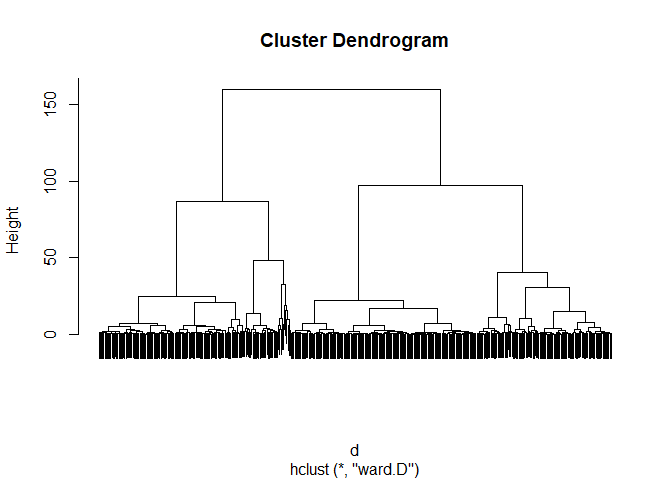
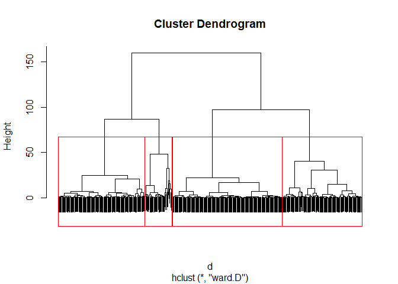
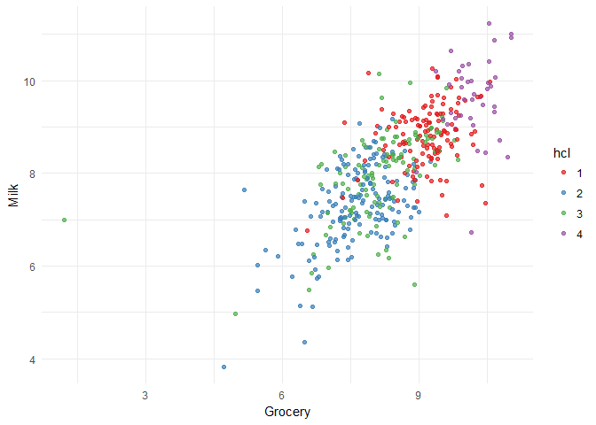
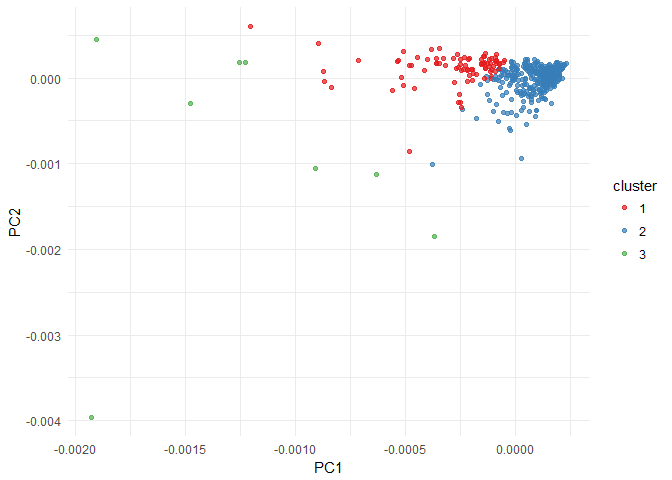
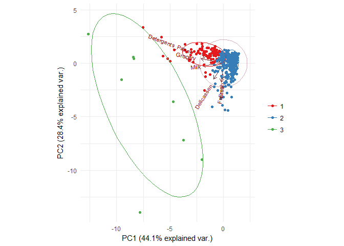

clustering with R
================

[Clustering with R](https://github.com/MNoorFawi/clustering-with-R)
-----------------

We will use "Wholesale customers data.csv" at <https://archive.ics.uci.edu/ml/machine-learning-databases/00292/> to perform **Hierarchical** and **Kmeans Clustering** using **R**.

First we load the data and look at it:

``` r
data <- read.csv("Wholesale customers data.csv")
str(data)
```

    ## 'data.frame':    440 obs. of  8 variables:
    ##  $ Channel         : int  2 2 2 1 2 2 2 2 1 2 ...
    ##  $ Region          : int  3 3 3 3 3 3 3 3 3 3 ...
    ##  $ Fresh           : int  12669 7057 6353 13265 22615 9413 12126 7579 5963 6006 ...
    ##  $ Milk            : int  9656 9810 8808 1196 5410 8259 3199 4956 3648 11093 ...
    ##  $ Grocery         : int  7561 9568 7684 4221 7198 5126 6975 9426 6192 18881 ...
    ##  $ Frozen          : int  214 1762 2405 6404 3915 666 480 1669 425 1159 ...
    ##  $ Detergents_Paper: int  2674 3293 3516 507 1777 1795 3140 3321 1716 7425 ...
    ##  $ Delicassen      : int  1338 1776 7844 1788 5185 1451 545 2566 750 2098 ...

``` r
summary(data)
```

    ##     Channel          Region          Fresh             Milk      
    ##  Min.   :1.000   Min.   :1.000   Min.   :     3   Min.   :   55  
    ##  1st Qu.:1.000   1st Qu.:2.000   1st Qu.:  3128   1st Qu.: 1533  
    ##  Median :1.000   Median :3.000   Median :  8504   Median : 3627  
    ##  Mean   :1.323   Mean   :2.543   Mean   : 12000   Mean   : 5796  
    ##  3rd Qu.:2.000   3rd Qu.:3.000   3rd Qu.: 16934   3rd Qu.: 7190  
    ##  Max.   :2.000   Max.   :3.000   Max.   :112151   Max.   :73498  
    ##     Grocery          Frozen        Detergents_Paper    Delicassen     
    ##  Min.   :    3   Min.   :   25.0   Min.   :    3.0   Min.   :    3.0  
    ##  1st Qu.: 2153   1st Qu.:  742.2   1st Qu.:  256.8   1st Qu.:  408.2  
    ##  Median : 4756   Median : 1526.0   Median :  816.5   Median :  965.5  
    ##  Mean   : 7951   Mean   : 3071.9   Mean   : 2881.5   Mean   : 1524.9  
    ##  3rd Qu.:10656   3rd Qu.: 3554.2   3rd Qu.: 3922.0   3rd Qu.: 1820.2  
    ##  Max.   :92780   Max.   :60869.0   Max.   :40827.0   Max.   :47943.0

Here we can find that except for the first two columns, which can be categories and can be one-hot encoded if needed but we will neglect them here, the rest of the columns are numeric and need to be scaled or normalized. 
So we scale them and then get the **euclidean distance** between the observations in order to pass it to the **hclust** function to do Hierarchical Clustering first ...

``` r
data[, 1:2] <- apply(data[, 1:2], 2, function(x) as.factor(x))
vars <- colnames(data)

## to one hot encode factor values and normalize numeric ones if needed
# cat <- vars[sapply(data[, vars], class) %in% c("factor", "character")]
num <- vars[sapply(data[, vars], class) %in% c("numeric", "integer")]
# for (i in cat) {
#   dict <- unique(data[, i])
#   for(key in dict){
#     data[[paste0(i, "_", key)]] <- 1.0 * (data[, i] == key)
#  }
# }
# data[, num] <- apply(data[, num], 2, function(x) {
#   (x - min(x)) / (max(x) - min(x))
# })
# 
# data <- data[, -which(colnames(data) %in% cat)]
# cmatrix <- as.matrix(sapply(data[, num], as.numeric))

## but here we will only scale numeric values
cmatrix <- scale(data[, num])
head(cmatrix)
```

    ##            Fresh        Milk     Grocery     Frozen Detergents_Paper
    ## [1,]  0.05287300  0.52297247 -0.04106815 -0.5886970      -0.04351919
    ## [2,] -0.39085706  0.54383861  0.17012470 -0.2698290       0.08630859
    ## [3,] -0.44652098  0.40807319 -0.02812509 -0.1373793       0.13308016
    ## [4,]  0.09999758 -0.62331041 -0.39253008  0.6863630      -0.49802132
    ## [5,]  0.83928412 -0.05233688 -0.07926595  0.1736612      -0.23165413
    ## [6,] -0.20457266  0.33368675 -0.29729863 -0.4955909      -0.22787885
    ##       Delicassen
    ## [1,] -0.06626363
    ## [2,]  0.08904969
    ## [3,]  2.24074190
    ## [4,]  0.09330484
    ## [5,]  1.29786952
    ## [6,] -0.02619421

``` r
## Hierarchical Clustering
d <- dist(cmatrix, method = "euclidean")
pfit <- hclust(d, method = "ward.D")
plot(pfit, labels = FALSE)
```



As we can see in the dendrogram plotted, the data can be clustered to different cluster numbers. Hierarchical Clustering with "WARD" method tries to minimize the total within sum of squares (WSS) of the clustering, so based on that, it's seen in the dendrogram that the data can be clustered to about 4 main clusters. 
We can see that in the dendrogram with:

``` r
plot(pfit, labels = FALSE)
rect.hclust(pfit, k = 4)
```



To extract the members of each cluster from the hclust object, we can use cutree(). And we can then visualize the data with these clusters.

``` r
hcl_groups <- factor(cutree(pfit, k = 4))
## visualize clusters in the data
suppressMessages(library(ggplot2))
data$hcl <- hcl_groups
ggplot(data, aes(x = log(Grocery),
                 y = log(Milk),
                 color = hcl)) +
  geom_point(alpha = 0.7, 
             position = position_jitter(h = 0.5, w = 0.5)) + 
  theme_minimal() + 
  scale_color_brewer(palette = "Set1") +
  labs(x = "Grocery", y = "Milk") 
```



###### We can clearly see that Milk and Grocery have a linear relationship that is of a strong positive correlation coefficient, so we expect them to be together in one of the clusters.

#### Bootsrap Evaluation of the Clusters.
Clustering algorithms don't have an evaluation metric like other supervised algorithms. So it is sometimes hard to tell if the clusters suggested by the algorithm express a real pattern in the data or it is just a random guessing by the algorithm.
**fpc** package has a function which can help in this. **clusterboot()**, this function does **Bootstrap Evaluation** to the clust


``` r
## Bootstrap Evaluation of Clusters
suppressMessages(library(fpc))
k_estimated <- 4
cboot_hclust <- clusterboot(cmatrix, clustermethod = hclustCBI,
                            method = "ward.D", k = k_estimated,
                            count = FALSE)
hcl_cboot_groups <- cboot_hclust$result$partition
cboot_hclust$bootmean
```

    ## [1] 0.5822147 0.6742406 0.5586298 0.4891219

``` r
cboot_hclust$bootbrd
```

    ## [1] 29  5 37 58

``` r
## picking K for kmeans
clustering_ch <- kmeansruns(cmatrix, krange = 1:10, criterion = "ch")
clustering_ch$bestk
```

    ## [1] 10

``` r
clustering_asw <- kmeansruns(cmatrix, krange = 1:10, criterion = "asw")
clustering_asw$bestk
```

    ## [1] 2

``` r
## plot it
suppressMessages(library(reshape2))
criteria <- data.frame(k = 1:10, ch = scale(clustering_ch$crit), 
                       asw = scale(clustering_asw$crit))
criteria <- melt(criteria, id.vars = c("k"), 
                  variable.name = "measure", 
                  value.name = "score")
ggplot(criteria, aes(x = k, y = score, col = measure)) + 
  geom_point(aes(shape = measure)) + 
  geom_line(aes(linetype = measure)) + 
  scale_x_continuous(breaks = 1:10, labels = 1:10) + 
  scale_color_brewer(palette = "Set1") + 
  theme_minimal()
```


``` r
## clusterboot() revisited with kmeans
kmeans_cboot <- clusterboot(cmatrix, clustermethod = kmeansCBI,
                            runs = 100, iter.max = 100,
                            krange = 3, seed = 13,
                            count = FALSE)
kmeans_cboot_groups <- kmeans_cboot$result$partition
kmeans_cboot$bootmean
```

    ## [1] 0.5428560 0.8714325 0.3491429

``` r
kmeans_cboot$bootbrd
```

    ## [1] 57  0 84

``` r
## Visualizing Clusters
## PCA done on dimensions you want to examine the clusters on
## those dimensions should be scaled 
pca <- prcomp(cmatrix)
visual <- predict(pca, newdata = cmatrix)[, 1:2]
visual <- cbind(as.data.frame(visual), 
                cluster = as.factor(kmeans_cboot_groups))
ggplot(visual, aes(x = PC1, y = PC2)) + 
  geom_point(aes(col = cluster), 
             # position = position_jitter(h = 0.5, w = 0.5), 
             alpha = 0.7) +
  theme_minimal() +
    scale_color_brewer(palette = "Set1")
```



``` r
suppressMessages(library(ggbiplot))
ggbiplot(pca, obs.scale = 1,
         ellipse = TRUE, circle = TRUE,
         groups = factor(kmeans_cboot_groups)
         ) +
  scale_color_brewer(palette = "Set1", name = "") +
  theme_minimal()                                 
```



